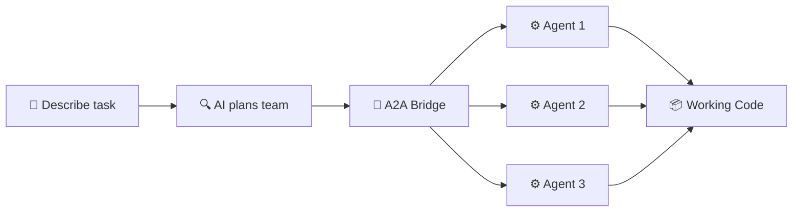

<p align="center"></p>

# a2a-crews

### One command. AI designs the team. Agents write the code.

You describe the task. The AI planner reads your codebase, assesses feasibility, designs a custom team, and launches agents that build it — in parallel, with tests. What used to take hours of prompt engineering happens in one command.

[](LICENSE)
[](https://www.typescriptlang.org/)
[](https://a2aproject.org)
[](tests/)

> **Requires:** [Bun](https://bun.sh) · [GitHub Copilot CLI](https://docs.github.com/copilot) · [Windows Terminal](https://aka.ms/terminal) or tmux

```
$ crews plan "Build a search ranking classifier"

  ╔══════════════════════════════════════════════╗
  ║  PLANNING                                    ║
  ╚══════════════════════════════════════════════╝

  ⚠️  RISKY (60%) — 4 roles, 4 tasks

  Concerns:
    • Position bias in training data may skew rankings
    • No existing evaluation harness — need to build from scratch

  ROLES
    data-engineer:    Feature pipeline + data profiling
    ranking-modeler:  ONNX model + hyperparameter search
    api-integrator:   Serving endpoint + integration
    evaluator:        NDCG/MRR metrics + A/B test plan

  TASKS
    ⏳ profile-data     → data-engineer   [pending]
    ⏳ train-model      → ranking-modeler  [pending]  (← profile-data)
    ⏳ build-endpoint   → api-integrator   [pending]  (← train-model)
    ⏳ evaluate          → evaluator        [pending]  (← build-endpoint)

  ✅ Plan written. Run `crews apply` to create the team.
```

That's not a template. The AI planner **read the codebase**, understood it's an ML problem, invented four domain-specific roles, and flagged position bias as a real risk. No other tool does this.

---

## Why a2a-crews?

|  | a2a-crews | CrewAI | LangGraph | AutoGen |
|--|-----------|--------|-----------|---------|
| **AI planner reads codebase** | ✅ Via Copilot CLI | ❌ | ❌ | ❌ |
| **Auto-generates team from task** | ✅ Or use 13 presets | ⚠️ You define roles | ⚠️ You build graph | ⚠️ You configure |
| **Pre-flight feasibility gate** | ✅ Heuristic scoring | ❌ | ❌ | ❌ |
| **A2A protocol (SDK types)** | ✅ `@a2a-js/sdk` | ❌ | ❌ | ❌ |
| **Agent-to-agent messaging** | ✅ Bridge relay | ❌ File-based | ❌ | ⚠️ Chat |
| **Cost & token tracking** | ✅ Per-agent + budget | ❌ | ❌ | ❌ |
| **Human-in-the-loop** | ✅ `input-required` state | ⚠️ Manual | ⚠️ Interrupt | ⚠️ Manual |
| **Auto-retry + recovery** | ✅ Exponential backoff | ⚠️ Basic | ❌ | ❌ |

**The difference:** You describe the task. a2a-crews spawns an AI planner (via Copilot CLI) that explores your repo, understands the domain, and designs a team with feasibility checks — before spending tokens on execution.

---

## Quick Start

```bash
# Install (one command)
bun install -g a2a-crews

crews plan "Build a REST API with auth and tests"
crews apply
crews launch

# Or target a different project directory
crews -d /path/to/project plan "Build a dashboard"
```

Agents spawn in parallel terminal tabs, coordinate via [A2A protocol](https://a2aproject.org), and deliver working code. Watch with `crews watch`. Stop with `crews stop`. Agents can message each other, report errors, and request human input — all through the bridge.

---

## See It Adapt

The same tool. Different intelligence for each problem.

**Simple task → preset template:**
```
$ crews plan "Build a calculator"

  ✅ GO (85%) — feature template
  🏗️ Architect → 💻 Coder → 🔍 Reviewer
  Waves: design → implement → review
```

**Complex task → AI-generated team:**
```
$ crews plan "Build a fullstack dashboard with real-time updates"

  ✅ GO (85%) — fullstack template
  🏗️ Architect → ⚙️ Backend ║ 🎨 Frontend → 🔍 Reviewer
  Waves: design → backend + frontend (parallel!) → review
```

**Ambiguous task → AI planner invents roles + flags risks:**
```
$ crews plan "Build a classifier for search ranking"

  ⚠️ RISKY (60%) — AI-generated, 4 custom roles
  🔧 Data Engineer → 📊 Ranking Modeler → 🔌 API Integrator → 📈 Evaluator
  Concerns: position bias, no eval harness, needs domain expertise
```

---

## The AI Planner

This is what makes a2a-crews different. When no template fits, the AI planner takes over.

1. **Explores your codebase** — reads file tree, package.json, source files, README
2. **Understands the domain** — ML vs API vs frontend vs infrastructure
3. **Creates custom roles** — not "architect/coder/reviewer" but "data-engineer/ranking-modeler/evaluator"
4. **Assesses feasibility** — flags real concerns with confidence scores

Every plan gets a three-factor gate **before a single token is spent**:

| Factor | What it checks |
|--------|---------------|
| **Technical** | Dependencies, ESM config, complexity keywords |
| **Scope** | Scenario size, codebase scale, feature splitting risk |
| **Risk** | Test coverage, git safety, security-sensitive keywords |

Verdicts: **GO** (>80%) · **RISKY** (50-80%) · **NO-GO** (<50%, won't proceed)

---

## 13 Templates

Preset team compositions. Or let the AI planner create a custom team.

| Category | Templates |
|----------|-----------|
| **Engineering** | `feature` · `fullstack` · `bugfix` · `refactor` · `harness` |
| **Data Science** | `data-science` · `ml-experiment` · `data-pipeline` |
| **Operations** | `audit` · `ship` · `sprint` · `research` |
| **Docs** | `doc-review` |

---

## How It Works



1. **`crews plan`** — Describe what you want. AI assesses feasibility and composes a team.
2. **`crews apply`** — Review the plan. Approve or tweak.
3. **`crews launch`** — Agents spawn in terminal tabs, register with the A2A bridge, execute in waves.
4. **`crews watch`** — Stream status via SSE. `crews stop` to cancel.

---

## What Gets Built

Example scenarios the planner handles — from simple presets to AI-generated custom teams:

| Scenario | Team generated | Execution |
|----------|---------------|-----------|
| `"Build a calculator"` | 3 roles (preset: feature) | 3 sequential waves |
| `"Build a fullstack dashboard"` | 4 roles (preset: fullstack) | Parallel backend + frontend |
| `"Build a search ranking classifier"` | 4 custom AI-generated roles | 4 waves, feasibility warnings |

The framework handles planning, spawning, coordination, and retry. Your agents do the coding.

---

## Goal loop

For long-running, coherent work with a clear success condition, wrap a crew run in a **goal loop**. A goal is a durable, evaluator-graded contract: once set, the crew works in checkpoints toward a **transcript-verifiable stopping condition** without per-turn steering, and stops when that condition is provably met.

**A goal is a 7-field contract** (`src/goal/contract.ts`):

| Field | Answers |
|---|---|
| `objective` | What is the crew trying to achieve? |
| `stoppingCondition` | Exactly when to stop — a runnable command, measurable threshold, or observable artifact. |
| `validationLoop` | The command that proves progress at every checkpoint. |
| `inputsToReadFirst` | Files/docs to read before acting. |
| `constraints` | Hard rules that must hold throughout. |
| `forbiddenMoves` | Specific actions the crew must not take. |
| `checkpointCadence` | What proves a checkpoint complete. |

`executionContext` (cwd, shell, timeout, services, side-effect boundaries) is optional but recommended.

**How the loop runs.** On each turn the [`GoalRunner`](src/goal/runner.ts) (a) runs the worker, (b) invokes a **separate evaluator** — the worker never grades itself — that grades progress from *surfaced evidence only* and records `reason` / `command` / `result`, (c) writes a checkpoint per cadence, and (d) stops when the stopping condition is met. It **auto-pauses after two consecutive validation failures** on the same slice so it never compounds bad work.

**Two-tier memory.** Working state (in-memory plan + turn/token counters + latest checkpoint) lives in the runner; **durable** state is persisted to `audits/goals/<id>/` (the 7-field contract in `contract.json` + `goal.md`, an append-only `checkpoints.jsonl`, and a `retrospective.md` on clear) so it is git-trackable and survives a lost session.

The evaluator is a pluggable interface — supply any grader from a2a-crews' model/provider layer via `functionEvaluator`, or use the conservative `DefaultEvaluator`.

```ts
import { GoalRunner, DefaultEvaluator, crewWorker } from './src/goal';

const runner = new GoalRunner();
runner.start({
  objective: 'Migrate internal/api from Gin to chi',
  stoppingCondition: '`bun test` exits 0 and coverage >= 80%',
  validationLoop: 'bun test --coverage',
  inputsToReadFirst: ['src/api/router.ts'],
  constraints: ['No route shape changes'],
  forbiddenMoves: ['Do not open a PR'],
  checkpointCadence: 'every file migrated + tests green',
});

// Wrap a crew run as the worker; a SEPARATE evaluator grades each turn.
const worker = crewWorker(crew, ({ turn }) => runNextSlice(turn));
await runner.run(worker, new DefaultEvaluator());
```

**CLI** (lifecycle equivalent to the slash commands):

```bash
crews goal start goal.json     # activate a 7-field contract (replaces any prior goal)
crews goal status              # condition, turns, tokens, checkpoints, latest evaluator reason
crews goal show                # print the full contract
crews goal checkpoint "note"   # force-write a checkpoint now
crews goal pause | resume      # pause / re-prime from durable state and continue
crews goal clear               # write a retrospective; keep history
```

---

<details>
<summary><strong>Under the Hood — Real A2A Protocol</strong></summary>

### A2A Protocol Implementation

Built on the **official [`@a2a-js/sdk`](https://github.com/a2aproject/a2a-js)** (v0.3.13) from Google's A2A project.

All types come from the SDK: `AgentCard`, `Message`, `Task`, `Part`, `Artifact`, `TaskState`.

#### JSON-RPC Methods (10 total)

| Method | Description | Streaming |
|--------|-------------|-----------|
| `message/send` | Send a message, get a Task back | No |
| `message/stream` | Send + SSE task updates | ✅ |
| `message/relay` | Route message between agents | No |
| `messages/poll` | Check agent inbox for messages | No |
| `tasks/get` | Retrieve task state + history + artifacts | No |
| `tasks/list` | Query tasks with filters + pagination | No |
| `tasks/cancel` | Cancel a running task | No |
| `tasks/subscribe` | Subscribe to live task updates | ✅ |

Plus REST endpoints: agent registration, heartbeat, error reporting, task CRUD.

#### Agent Discovery

```
GET /.well-known/agent-card.json
→ AgentCard { protocolVersion: "0.3.0", skills, capabilities, ... }
```

#### Key Capabilities

- **Task history**: Every message (user + agent) accumulated in `history[]`, returned via `tasks/get`
- **Agent messaging**: Agents relay messages through the bridge (`message/relay` → inbox → `messages/poll`)
- **Error reporting**: `POST /agents/:name/events` with structured types (port_conflict, tool_failure, etc.) — fatal errors auto-fail linked tasks
- **Human-in-the-loop**: `input-required` TaskState pauses tasks until user provides input, then resumes
- **Cost tracking**: Agents report token usage on task completion. `/status` shows per-agent and crew-wide totals with budget limits
- **Bridge registry**: Active bridges register at `~/.a2a-crews/active-bridges/` for cross-repo discovery
- **Exponential backoff retry**: Base 10min timeout × 1.5^attempt × 3 when files are changing (30-67min for active agents)

#### Production Hardening

Rate limits (100K tasks, 1K agents, 100 SSE, 1K inbox) · Circular event log (10K) · Text truncation (1MB) · SSE auto-close on disconnect · Input validation · Standard JSON-RPC error codes · Budget exceeded events

</details>

<details>
<summary><strong>Architecture Decisions</strong></summary>

Every design choice is backed by research. 10 ADRs in [`docs/architecture-decisions.md`](docs/architecture-decisions.md).

| ADR | Decision | Source |
|-----|----------|--------|
| 001 | Official `@a2a-js/sdk` types | A2A project |
| 003 | CrewAI Crew/Agent/Task pattern | CrewAI (47K⭐) |
| 005 | Task lifecycle follows A2A spec | A2A proto |
| 006 | SSE streaming, not polling | A2A spec |
| 010 | Agent card per spawned agent | A2A §7 |

</details>

---

## Install

```bash
git clone https://github.com/aviraldua93/a2a-crews.git
cd a2a-crews && bun install
```

<details>
<summary>Other install methods</summary>

```bash
# Global install
bun install -g a2a-crews

# Compiled binary
bun run build && ./crews plan "Build a calculator"
```

</details>

---

## Roadmap

- [x] **v0.1** — CLI, A2A bridge, 13 templates, wave orchestration, evidence recovery
- [x] **v0.2** — AI planner, feasibility assessment, `@a2a-js/sdk` integration
- [x] **v0.3** — Agent messaging, cost tracking, error reporting, input-required, exponential backoff retry, bridge registry, 149 tests
- [ ] **v0.4** — Review feedback loops, harness iteration
- [ ] **v1.0** — Web dashboard, push notifications, external agent federation

See [`ROADMAP.md`](ROADMAP.md) for details.

---

**Built on** [A2A Protocol](https://a2aproject.org) · [`@a2a-js/sdk`](https://github.com/a2aproject/a2a-js) · [Bun](https://bun.sh) · [CrewAI](https://github.com/crewAIInc/crewAI) patterns

[MIT](LICENSE) © 2026 Aviral Dua
