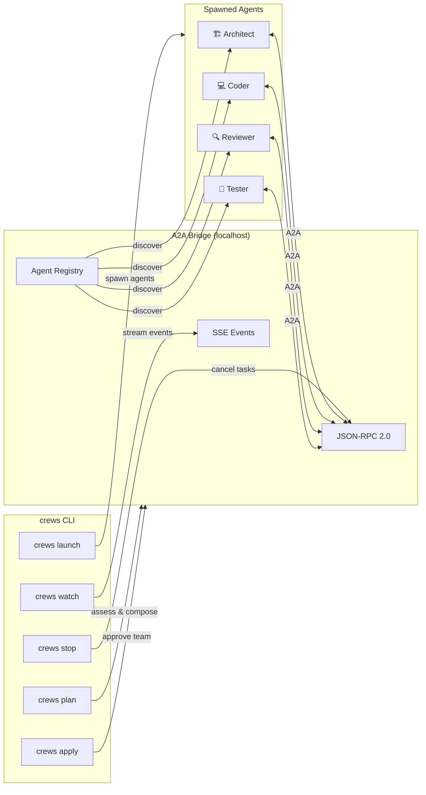

# a2a-crews

**One command. A team of AI agents. Built on Google's A2A protocol.**

[](LICENSE)
[](https://www.typescriptlang.org/)
[](https://bun.sh)
[](https://google.github.io/A2A/)
[](package.json)

Describe what you want built. `a2a-crews` assesses feasibility, composes a team of specialized AI agents, and orchestrates them through Google's [Agent-to-Agent (A2A)](https://google.github.io/A2A/) protocol — the open standard for agent interoperability.

---

## Architecture



---

## Quick Start

```bash
# Install
bun install -g a2a-crews

# 1. Describe what you want — get a feasibility assessment and team plan
crews plan "Build a REST API with auth, CRUD endpoints, and tests"

# 2. Review the plan, approve it
crews apply

# 3. Launch the team — agents spawn and start building
crews launch my-api

# 4. Watch them work in real time
crews watch my-api
```

---

## How It Works (30 seconds)

1. **`crews plan`** — You describe a scenario. Assessment agents evaluate feasibility, estimate complexity, and compose a team from preset templates.
2. **`crews apply`** — You review the plan: which agents, what tasks, what order. Approve or tweak.
3. **`crews launch`** — The CLI spawns AI agents in terminal sessions. Each agent registers with an embedded A2A bridge running on localhost.
4. **Agents execute** — They communicate via A2A's JSON-RPC protocol. Tasks flow through waves: design → implement → review. Each agent publishes an A2A agent card and streams status via SSE.
5. **`crews watch`** — Live stream of agent status, task progress, and completion events.
6. **`crews stop`** — Cancel all in-flight tasks and shut down agents.

---

## Templates

13 preset team compositions covering common development workflows:

| Template | Domain | Roles | Flow |
|----------|--------|-------|------|
| `feature` | General | Architect → Coder → Reviewer | Design → Implement → Review |
| `fullstack` | Web | Architect → Backend → Frontend → Reviewer | API contract → Parallel impl → Review |
| `refactor` | Code Quality | Analyst → Refactorer → Reviewer | Audit → Refactor → Validate |
| `bugfix` | Debugging | Investigator → Fixer → Reviewer | Reproduce → Fix → Verify |
| `harness` | Testing | Analyst → Test Writer → Reviewer | Coverage analysis → Write tests → Review |
| `audit` | Security | Scanner → Analyst → Fixer → Reviewer | Scan → Assess → Remediate → Verify |
| `doc-review` | Documentation | Auditor → Writer → Reviewer | Audit gaps → Write docs → Review |
| `data-pipeline` | Data Eng | Architect → Builder → Tester | Design → Build → Validate |
| `data-science` | ML/AI | Data Engineer → Modeler → Evaluator → Reporter | Profile → Train → Evaluate → Report |
| `ml-experiment` | ML/AI | Researcher → Experimenter → Analyst | Hypothesis → Experiment → Analyze |
| `research` | Research | Scout → Synthesizer → Critic | Gather → Synthesize → Critique |
| `ship` | DevOps | Builder → Deployer → Verifier | Build → Deploy → Smoke test |
| `sprint` | Project Mgmt | PM → Coder → Reviewer | Plan → Execute → Review |

---

## What Makes It Different

| | a2a-crews | CrewAI | Single Agent | Manual Orchestration |
|---|---|---|---|---|
| **Protocol** | A2A (open standard) | Proprietary | N/A | N/A |
| **Agent runtime** | Any (Copilot CLI, custom) | Python only | One process | Whatever you wire up |
| **Interop** | Any A2A client can join | Locked to CrewAI | None | None |
| **Setup** | One command | Python env + config | Just works | Hours of scripting |
| **Real-time streaming** | SSE built in | Callbacks | Terminal output | Polling / logs |
| **Team composition** | 13 presets + custom | YAML config | N/A | Manual |

**Key differentiators:**
- **A2A-native** — Not a wrapper. Agents speak A2A natively, making them discoverable and composable with any A2A-compatible system.
- **Runtime-agnostic** — The bridge doesn't care what's behind an agent. Copilot CLI today, custom agents tomorrow.
- **Embedded bridge** — No external infrastructure. The A2A server starts and stops with your session.

---

## Architecture Decisions

Detailed ADRs with research sources are documented in [`docs/architecture-decisions.md`](docs/architecture-decisions.md).

Key decisions:
- **ADR-001:** Use official `@a2a-js/sdk` — don't reimplement A2A types
- **ADR-002:** Follow python-a2a's HTTP route structure for compatibility
- **ADR-003:** Follow CrewAI's Crew/Agent/Task class separation
- **ADR-005:** Task lifecycle follows A2A spec exactly (`submitted → working → completed`)
- **ADR-006:** SSE for real-time updates, not polling

---

## Roadmap

- [x] **Phase 0** — CLI skeleton, templates, README
- [ ] **Phase 1** — Embedded A2A bridge (Bun.serve + JSON-RPC 2.0)
- [ ] **Phase 2** — Agent spawning (terminal sessions + A2A registration)
- [ ] **Phase 3** — Full orchestration (plan → apply → launch → watch)
- [ ] **Phase 4** — Cross-platform binary, test suite, polish

See [`PLAN.md`](PLAN.md) for the full build plan.

---

## Install

### Option A: Bun (recommended)
```bash
bun install -g a2a-crews
```

### Option B: From source
```bash
git clone https://github.com/aviraldua93/a2a-crews.git
cd a2a-crews
bun install
bun run dev          # run directly
bun run build        # compile binary
```

### Option C: Compiled binary
Download from [Releases](https://github.com/aviraldua93/a2a-crews/releases) or build:
```bash
bun run build
./crews plan "Build a calculator"
```

### Requirements
- [Bun](https://bun.sh) 1.0+
- [GitHub Copilot CLI](https://docs.github.com/copilot/how-tos/copilot-cli) (`copilot` command)
- [Windows Terminal](https://aka.ms/terminal) (Windows) or `tmux` (macOS/Linux)

---

## Tech Stack

- **Runtime:** [Bun](https://bun.sh) — fast TypeScript runtime with native test runner
- **Protocol:** [A2A](https://google.github.io/A2A/) — Google's Agent-to-Agent protocol
- **SDK:** [`a2a-js`](https://github.com/a2aproject/a2a-js) — Official A2A TypeScript SDK
- **Patterns:** Inspired by [CrewAI](https://github.com/crewAIInc/crewAI) (47K⭐) orchestration patterns

---

## License

[MIT](LICENSE) © 2026 Aviral Dua
