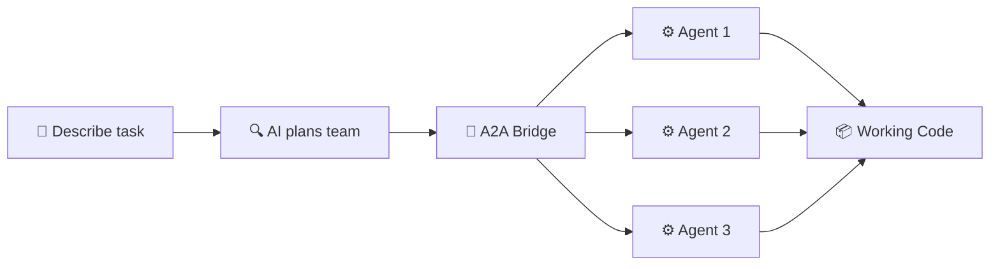

# a2a-crews

### One command. AI designs the team. Agents write the code.

You describe the task. The AI planner reads your codebase, assesses feasibility, designs a custom team, and launches agents that build it — in parallel, with tests. What used to take hours of prompt engineering happens in one command.

[](LICENSE)
[](https://www.typescriptlang.org/)
[](https://a2aproject.org)
[](tests/)

> **Requires:** [Bun](https://bun.sh) · [GitHub Copilot CLI](https://docs.github.com/copilot) · [Windows Terminal](https://aka.ms/terminal) or tmux

```
$ crews plan "Build a search ranking classifier"

  ╔══════════════════════════════════════════════╗
  ║  PLANNING                                    ║
  ╚══════════════════════════════════════════════╝

  ⚠️  RISKY (60%) — 4 roles, 4 tasks

  Concerns:
    • Position bias in training data may skew rankings
    • No existing evaluation harness — need to build from scratch

  ROLES
    data-engineer:    Feature pipeline + data profiling
    ranking-modeler:  ONNX model + hyperparameter search
    api-integrator:   Serving endpoint + integration
    evaluator:        NDCG/MRR metrics + A/B test plan

  TASKS
    ⏳ profile-data     → data-engineer   [pending]
    ⏳ train-model      → ranking-modeler  [pending]  (← profile-data)
    ⏳ build-endpoint   → api-integrator   [pending]  (← train-model)
    ⏳ evaluate          → evaluator        [pending]  (← build-endpoint)

  ✅ Plan written. Run `crews apply` to create the team.
```

That's not a template. The AI planner **read the codebase**, understood it's an ML problem, invented four domain-specific roles, and flagged position bias as a real risk. No other tool does this.

---

## Why a2a-crews?

|  | a2a-crews | CrewAI | LangGraph | AutoGen |
|--|-----------|--------|-----------|---------|
| **Reads your codebase first** | ✅ Auto-discovers domain | ❌ Manual setup | ❌ Manual setup | ❌ Manual setup |
| **AI designs the team** | ✅ Domain-aware roles | ❌ You pick roles | ❌ You build graph | ❌ You configure |
| **Feasibility scored** | ✅ Risk + confidence | ❌ | ❌ | ❌ |
| **A2A protocol native** | ✅ Official SDK | ❌ Custom | ❌ Custom | ❌ Custom |
| **Parallel wave execution** | ✅ DAG scheduling | ✅ | ✅ | ✅ |
| **Auto-retry + recovery** | ✅ Evidence-based | ⚠️ Basic | ❌ | ❌ |

**The difference:** Other tools make you design the team manually. a2a-crews reads your project, understands the domain, catches risks before you spend tokens, and builds a team that actually fits the problem.

---

## Quick Start

```bash
# Install (one command)
bun install -g a2a-crews

crews plan "Build a REST API with auth and tests"
crews apply
crews launch
```

Agents spawn in parallel terminal tabs, coordinate via [A2A protocol](https://a2aproject.org), and deliver working code. Watch with `crews watch`. Stop with `crews stop`.

---

## See It Adapt

The same tool. Different intelligence for each problem.

**Simple task → preset template:**
```
$ crews plan "Build a calculator"

  ✅ GO (85%) — feature template
  🏗️ Architect → 💻 Coder → 🔍 Reviewer
  Waves: design → implement → review
```

**Complex task → AI-generated team:**
```
$ crews plan "Build a fullstack dashboard with real-time updates"

  ✅ GO (85%) — fullstack template
  🏗️ Architect → ⚙️ Backend ║ 🎨 Frontend → 🔍 Reviewer
  Waves: design → backend + frontend (parallel!) → review
```

**Ambiguous task → AI planner invents roles + flags risks:**
```
$ crews plan "Build a classifier for search ranking"

  ⚠️ RISKY (60%) — AI-generated, 4 custom roles
  🔧 Data Engineer → 📊 Ranking Modeler → 🔌 API Integrator → 📈 Evaluator
  Concerns: position bias, no eval harness, needs domain expertise
```

---

## The AI Planner

This is what makes a2a-crews different. When no template fits, the AI planner takes over.

1. **Explores your codebase** — reads file tree, package.json, source files, README
2. **Understands the domain** — ML vs API vs frontend vs infrastructure
3. **Creates custom roles** — not "architect/coder/reviewer" but "data-engineer/ranking-modeler/evaluator"
4. **Assesses feasibility** — flags real concerns with confidence scores

Every plan gets a three-factor gate **before a single token is spent**:

| Factor | What it checks |
|--------|---------------|
| **Technical** | Dependencies, ESM config, complexity keywords |
| **Scope** | Scenario size, codebase scale, feature splitting risk |
| **Risk** | Test coverage, git safety, security-sensitive keywords |

Verdicts: **GO** (>80%) · **RISKY** (50-80%) · **NO-GO** (<50%, won't proceed)

---

## 13 Templates

Preset team compositions. Or let the AI planner create a custom team.

| Category | Templates |
|----------|-----------|
| **Engineering** | `feature` · `fullstack` · `bugfix` · `refactor` · `harness` |
| **Data Science** | `data-science` · `ml-experiment` · `data-pipeline` |
| **Operations** | `audit` · `ship` · `sprint` · `research` |
| **Docs** | `doc-review` |

---

## How It Works



1. **`crews plan`** — Describe what you want. AI assesses feasibility and composes a team.
2. **`crews apply`** — Review the plan. Approve or tweak.
3. **`crews launch`** — Agents spawn in terminal tabs, register with the A2A bridge, execute in waves.
4. **`crews watch`** — Stream status via SSE. `crews stop` to cancel.

---

## Proven Results

These ran fully autonomously — no human intervention after `crews launch`.

| Project | Delivered | Outcome |
|---------|-----------|---------|
| **Calculator** | Arithmetic engine with edge cases | 45 tests passing |
| **Fullstack Dashboard** | Express API + HTML frontend | Working E2E |
| **ML Classifier** | ONNX model + pipeline + eval harness + A/B plan | Full ML pipeline |

---

<details>
<summary><strong>Under the Hood — Real A2A Protocol</strong></summary>

### A2A Protocol Implementation

Built on the **official [`@a2a-js/sdk`](https://github.com/a2aproject/a2a-js)** (v0.3.13) from Google's A2A project.

All types come from the SDK: `AgentCard`, `Message`, `Task`, `Part`, `Artifact`, `TaskState`.

#### JSON-RPC Methods

| Method | Description | Streaming |
|--------|-------------|-----------|
| `message/send` | Send a message, get a Task back | No |
| `message/stream` | Send + SSE task updates | ✅ |
| `tasks/get` | Retrieve task state + artifacts | No |
| `tasks/list` | Query tasks with filters + pagination | No |
| `tasks/cancel` | Cancel a running task | No |
| `tasks/subscribe` | Subscribe to live task updates | ✅ |

#### Agent Discovery

```
GET /.well-known/agent-card.json
→ AgentCard { protocolVersion: "0.3.0", skills, capabilities, ... }
```

#### Production Hardening

Rate limits (100K tasks, 1K agents, 100 SSE) · Circular event log (10K) · Text truncation (1MB) · SSE auto-close on disconnect · Input validation · Standard JSON-RPC error codes

</details>

<details>
<summary><strong>Architecture Decisions</strong></summary>

Every design choice is backed by research. 10 ADRs in [`docs/architecture-decisions.md`](docs/architecture-decisions.md).

| ADR | Decision | Source |
|-----|----------|--------|
| 001 | Official `@a2a-js/sdk` types | A2A project |
| 003 | CrewAI Crew/Agent/Task pattern | CrewAI (47K⭐) |
| 005 | Task lifecycle follows A2A spec | A2A proto |
| 006 | SSE streaming, not polling | A2A spec |
| 010 | Agent card per spawned agent | A2A §7 |

</details>

---

## Install

```bash
git clone https://github.com/aviraldua93/a2a-crews.git
cd a2a-crews && bun install
```

<details>
<summary>Other install methods</summary>

```bash
# Global install
bun install -g a2a-crews

# Compiled binary
bun run build && ./crews plan "Build a calculator"
```

</details>

---

## Roadmap

- [x] **v0.1** — CLI, A2A bridge, 13 templates, wave orchestration, 119 tests
- [x] **v0.2** — AI planner, feasibility assessment, `@a2a-js/sdk` integration
- [ ] **v0.3** — Auto-retry, heartbeat monitoring, checkpoint handoff
- [ ] **v0.4** — Review feedback loops, harness iteration
- [ ] **v1.0** — External A2A agent interop, web dashboard, cost tracking

See [`ROADMAP.md`](ROADMAP.md) for details.

---

**Built on** [A2A Protocol](https://a2aproject.org) · [`@a2a-js/sdk`](https://github.com/a2aproject/a2a-js) · [Bun](https://bun.sh) · [CrewAI](https://github.com/crewAIInc/crewAI) patterns

[MIT](LICENSE) © 2026 Aviral Dua
