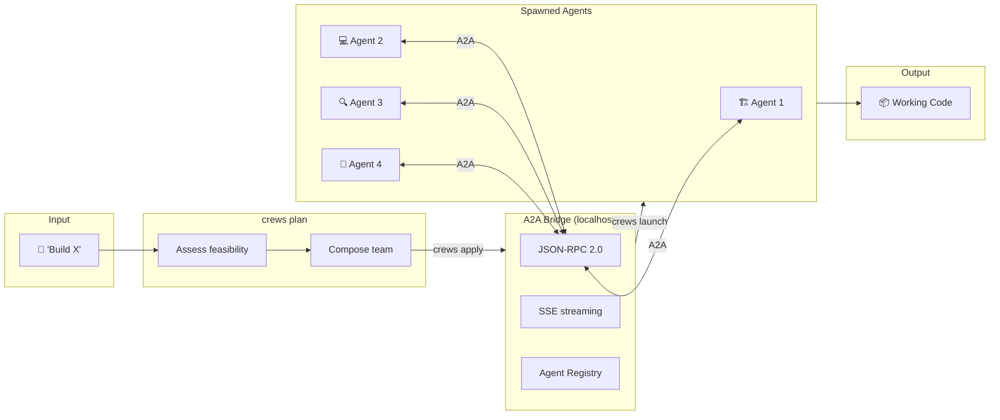

# a2a-crews

**Tell an AI what to build. It designs the team, assigns the work, and delivers working code.**

[](LICENSE)
[](https://www.typescriptlang.org/)
[](https://bun.sh)
[](https://google.github.io/A2A/)
[](tests/)
[](package.json)

> *"Build a classifier for search ranking"*

The AI planner explores your codebase, identifies it's an ML problem, and designs this team:

```
┌─────────────────────────────────────────────────────────────────┐
│  AI PLANNER OUTPUT                                              │
├─────────────────────────────────────────────────────────────────┤
│  Template:  AI-generated (not from presets)                     │
│  Verdict:   ⚠️  RISKY — 60% confidence                         │
│                                                                 │
│  Concerns:                                                      │
│  • Position bias in training data may skew rankings             │
│  • No existing evaluation harness — need to build from scratch  │
│  • Feature engineering requires domain expertise in search      │
│                                                                 │
│  Team:                                                          │
│  ┌──────────────────┐  ┌──────────────────┐                     │
│  │ 🔧 Data Engineer │  │ 📊 Ranking       │                     │
│  │ Feature pipeline │  │    Modeler       │                     │
│  │ + data profiling │  │ ONNX export +    │                     │
│  └────────┬─────────┘  │ hyperparameter   │                     │
│           │            │ search           │                     │
│           ▼            └────────┬─────────┘                     │
│  ┌──────────────────┐          │                                │
│  │ 🔌 API           │          │                                │
│  │    Integrator    │◄─────────┘                                │
│  │ Serving endpoint │                                           │
│  └────────┬─────────┘                                           │
│           │                                                     │
│           ▼                                                     │
│  ┌──────────────────┐                                           │
│  │ 📈 Evaluator     │                                           │
│  │ NDCG, MRR, A/B   │                                           │
│  │ test plan        │                                           │
│  └──────────────────┘                                           │
│                                                                 │
│  Waves:                                                         │
│  Wave 0: data-engineer (profile data, build feature pipeline)   │
│  Wave 1: ranking-modeler (train model, export ONNX)             │
│  Wave 2: api-integrator (serving endpoint + integration)        │
│  Wave 3: evaluator (NDCG/MRR metrics, A/B test plan)           │
└─────────────────────────────────────────────────────────────────┘
```

That's not a template. The AI planner read the codebase, understood the domain, and created four ML-specific roles with real concerns about position bias. No other tool does this.

---

## See It Work

Three real scenarios. Watch the planner adapt.

<table>
<tr>
<th>Calculator</th>
<th>ML Classifier</th>
<th>Fullstack Dashboard</th>
</tr>
<tr>
<td>

```
crews plan "Build a calculator"
```

```
Template:  feature (preset)
Verdict:   ✅ GO — 85%
Roles:     3

🏗️ Architect
  └→ design
💻 Coder
  └→ implement
🔍 Reviewer
  └→ review

Waves:
  0: design
  1: implement
  2: review
```

</td>
<td>

```
crews plan "Build a classifier
  for search ranking"
```

```
Template:  AI-generated
Verdict:   ⚠️ RISKY — 60%
Roles:     4

🔧 Data Engineer
  └→ feature pipeline
📊 Ranking Modeler
  └→ ONNX model
🔌 API Integrator
  └→ serving endpoint
📈 Evaluator
  └→ NDCG + A/B plan

Concerns:
• Position bias in data
• No eval harness exists
• Needs search domain
  expertise
```

</td>
<td>

```
crews plan "Build a fullstack
  dashboard"
```

```
Template:  fullstack (preset)
Verdict:   ✅ GO — 85%
Roles:     4

🏗️ Architect
  └→ API contract + UI spec
⚙️ Backend
  └→ Express endpoints
🎨 Frontend
  └→ HTML + styling
🔍 Reviewer
  └→ full-stack review

Waves:
  0: design
  1: backend, frontend ║
  2: review
```

</td>
</tr>
</table>

The calculator gets a 3-agent preset. The dashboard gets parallel backend + frontend. The classifier? The AI planner invents domain-specific roles, flags position bias as a risk, and plans an evaluation harness. **Same tool. Different intelligence for each problem.**

---

## Proven Results

These ran autonomously — `crews plan` → `crews apply` → `crews launch` → working code.

| Project | What was delivered | Tests |
|---------|-------------------|-------|
| **Calculator** | Full arithmetic engine with edge cases | 45 tests passing |
| **Fullstack Dashboard** | Express API + HTML frontend, end-to-end | Working app |
| **ML Ranking Classifier** | ONNX model + feature pipeline + evaluation harness + A/B test plan | Full ML pipeline |

Not demos. Not mockups. Working code with tests, built by autonomous agents.

---

## Quick Start

```bash
# Install
bun install -g a2a-crews

# Plan → Approve → Launch (that's it)
crews plan "Build a REST API with auth and tests"
crews apply
crews launch
```

Your agents spawn in parallel terminal tabs, coordinate via A2A protocol, and deliver working code. Watch them with `crews watch`.

---

## How It Works



1. **`crews plan`** — Describe what you want. The AI planner (or a preset template) assesses feasibility and composes a team.
2. **`crews apply`** — Review the plan: agents, tasks, wave order. Approve or tweak.
3. **`crews launch`** — Agents spawn in terminal tabs. Each registers with the embedded A2A bridge.
4. **Agents execute** — Tasks flow through waves (design → implement → review). Agents communicate via A2A JSON-RPC. Status streams via SSE.
5. **`crews watch`** / **`crews stop`** — Monitor progress or cancel.

---

## 13 Templates

Preset team compositions for common workflows. Or let the AI planner create a custom team.

### Engineering

| Template | Roles | Flow |
|----------|-------|------|
| `feature` | Architect → Coder → Reviewer | Design → Implement → Review |
| `fullstack` | Architect → Backend → Frontend → Reviewer | API contract → Parallel impl → Review |
| `bugfix` | Investigator → Fixer → Reviewer | Reproduce → Fix → Verify |
| `refactor` | Explorer → Coder → Tester → Reviewer | Audit → Refactor → Test → Validate |
| `harness` | Planner → Generator → Evaluator | Plan → Generate → Evaluate (iterative) |

### Data Science

| Template | Roles | Flow |
|----------|-------|------|
| `data-science` | Data Engineer → Modeler → Evaluator → Reporter | Profile → Train → Evaluate → Report |
| `ml-experiment` | Experimenter ×3 → Synthesizer | 3 parallel approaches → Pick winner |
| `data-pipeline` | Extractor → Transformer → Loader → Validator | Extract → Transform → Load → Validate |

### Operations

| Template | Roles | Flow |
|----------|-------|------|
| `audit` | Security → Perf → Quality → Synthesizer | 3 parallel audits → Synthesize |
| `ship` | Release Manager → QA → Reviewer | Build → Test → Ship |
| `sprint` | PM → Architect → Coder → QA → Reviewer | Plan → Design → Build → Test → Review |
| `research` | Researcher ×3 → Synthesizer | 3 parallel investigations → Synthesize |

### Documentation

| Template | Roles | Flow |
|----------|-------|------|
| `doc-review` | Accuracy → Completeness → Audience → Platform → Synthesizer | 4 parallel reviews → Synthesize |

---

## The AI Planner

This is what makes a2a-crews different. When no template fits, the AI planner takes over.

**It doesn't match keywords. It thinks.**

1. **Explores your codebase** — reads your file tree, package.json, source files, README
2. **Understands the domain** — identifies ML vs API vs frontend vs infrastructure
3. **Creates custom roles** — not "architect/coder/reviewer" but "data-engineer/ranking-modeler/evaluator" with task-specific skills
4. **Assesses feasibility** — flags real concerns (position bias, missing test harnesses, security-sensitive scope) with confidence scores

The planner is constrained: max 5 roles, max 3 tasks per role. It designs tight, focused teams — not sprawling bureaucracies.

### Feasibility Assessment

Every plan gets a three-factor assessment before a single token is spent:

| Factor | What it checks |
|--------|---------------|
| **Technical** | Package manager config, dependency count (>50 flagged), ESM setup, complexity keywords |
| **Scope** | Scenario size, codebase scale (>100 files), feature splitting risk ("and" clause detection) |
| **Risk** | Test directory existence, git repo (rollback safety), security-sensitive keywords (auth, payment, secrets) |

Verdicts: **GO** (>80% confidence) · **RISKY** (50-80%) · **NO-GO** (<50%, won't proceed)

---

<details>
<summary><strong>Under the Hood</strong></summary>

### A2A Bridge

An embedded A2A-compliant server starts with your session. No Docker, no external infra.

- `GET /.well-known/agent.json` — A2A agent card (discovery)
- `POST /` — JSON-RPC 2.0 dispatch (task operations)
- `GET /status` — Bridge health + registered agents
- SSE streaming for real-time events

Any A2A-compatible client can connect. The bridge doesn't know or care what's behind each agent.

### Wave Orchestration

Tasks execute in dependency-ordered waves:

```
Wave 0: [design]              — no dependencies
Wave 1: [backend, frontend]   — both depend on design, run in parallel
Wave 2: [review]              — depends on both Wave 1 tasks
```

Deadlock detection catches circular dependencies before launch.

### Auto-Retry & Recovery

- **Evidence-based recovery** — if an agent dies, the system detects deliverable files already written and credits that work
- **Post-exit bridge notification** — agents report completion even after terminal close
- **Context checkpoints** — long-running agents save progress for handoff

### Agent Communication

Each agent gets:
- A generated prompt with tasks, acceptance criteria, and allowed tools
- The A2A bridge URL for status reporting
- Review feedback loop instructions (reviewers create fix tasks for blocking issues)

Agents publish A2A agent cards, making them discoverable by any compliant client.

</details>

---

## Architecture Decisions

Every design choice is backed by research. 10 ADRs documented in [`docs/architecture-decisions.md`](docs/architecture-decisions.md).

| ADR | Decision | Source |
|-----|----------|--------|
| 001 | Use official `@a2a-js/sdk` — don't reimplement types | a2a-js official SDK |
| 002 | Follow python-a2a HTTP route structure | python-a2a (988⭐) |
| 003 | CrewAI's Crew/Agent/Task class separation | CrewAI (47K⭐) |
| 005 | Task lifecycle follows A2A spec exactly | A2A proto spec |
| 006 | SSE for real-time updates, not polling | A2A streaming spec |
| 007 | Dynamic tool composition per task | CrewAI pattern |
| 008 | Context as immutable data flow | CrewAI pattern |
| 009 | Event bus for telemetry | CrewAI event system |
| 010 | A2A agent card per spawned agent | A2A spec §7 |

---

## Roadmap

See [`ROADMAP.md`](ROADMAP.md) for the full plan.

- [x] **v0.1** — CLI, A2A bridge, 13 templates, wave orchestration, evidence recovery, 79+ tests
- [x] **v0.2** — AI planner, custom role generation, feasibility assessment
- [ ] **v0.3** — Auto-retry, heartbeat monitoring, context checkpoint handoff
- [ ] **v0.4** — Review feedback loops, structured grading, harness iteration
- [ ] **v0.5** — macOS/Linux, npm install, compiled binaries
- [ ] **v1.0** — External A2A agent interop, web dashboard, cost tracking

---

## Install

### From source (recommended)
```bash
git clone https://github.com/aviraldua93/a2a-crews.git
cd a2a-crews
bun install
bun run dev
```

### Global install
```bash
bun install -g a2a-crews
```

### Compiled binary
```bash
bun run build
./crews plan "Build a calculator"
```

### Requirements
- [Bun](https://bun.sh) 1.0+
- [GitHub Copilot CLI](https://docs.github.com/copilot/how-tos/copilot-cli) (`copilot` command)
- [Windows Terminal](https://aka.ms/terminal) (Windows) or `tmux` (macOS/Linux)

---

## Built On

- **[A2A Protocol](https://google.github.io/A2A/)** — Google's open standard for agent-to-agent communication
- **[a2a-js](https://github.com/a2aproject/a2a-js)** — Official A2A TypeScript SDK
- **[Bun](https://bun.sh)** — TypeScript runtime with native test runner
- **[CrewAI](https://github.com/crewAIInc/crewAI)** patterns — Crew/Agent/Task orchestration (47K⭐)
- Anthropic's research on [agent evaluation harnesses](https://www.anthropic.com/) — informed our iterative review loops

---

## License

[MIT](LICENSE) © 2026 Aviral Dua
